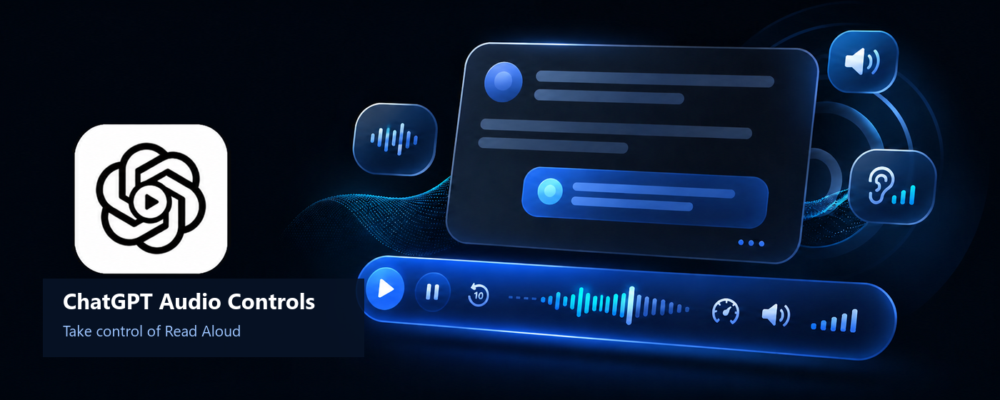
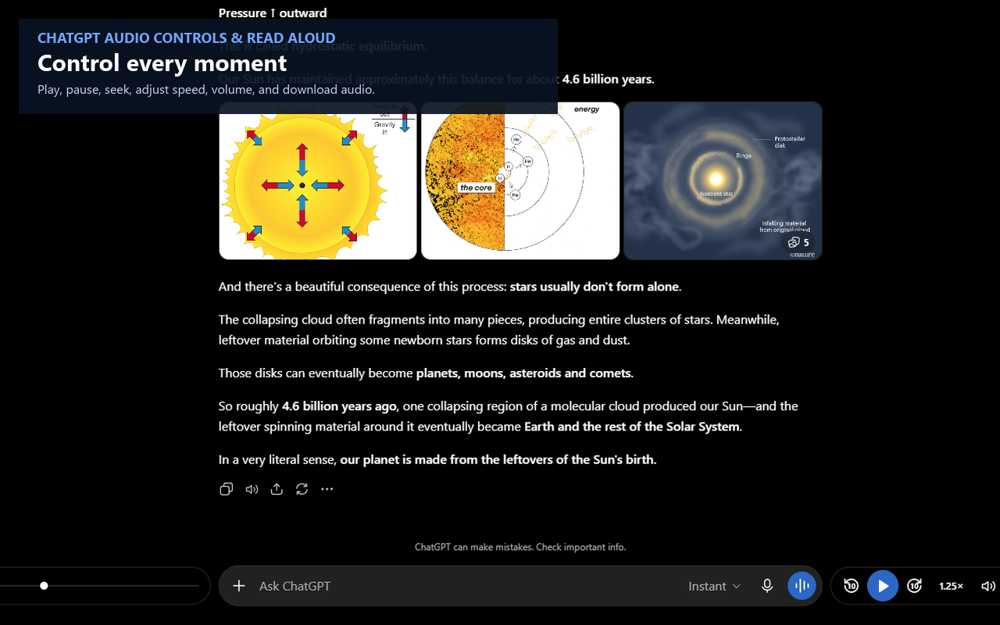
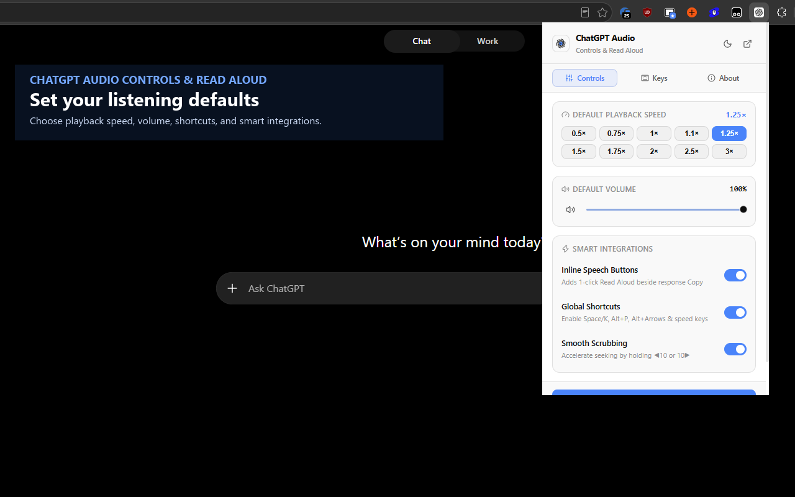

<div align="center">

# 🎙️ ChatGPT Audio Controls & Read Aloud

**Playback controls that make ChatGPT Read Aloud usable.**<br />
*Play, pause, seek, change speed, adjust volume, download audio, and start Read Aloud directly from a response.*

<p align="center">
  <a href="https://chromewebstore.google.com/detail/aifalimlfgiepmbejcemcofninobaiea/">
    
  </a>
  &nbsp;&nbsp;&nbsp;&nbsp;
  <a href="https://microsoftedge.microsoft.com/addons/detail/chatgpt-audio-controls-/cmhbacgmcgiolpidfjcpefkhbbeamemf">
    
  </a>
</p>

[](https://github.com/infoxica/chatgpt-audio-controls/releases)
[](https://chromewebstore.google.com/detail/aifalimlfgiepmbejcemcofninobaiea/)
[](https://microsoftedge.microsoft.com/addons/detail/chatgpt-audio-controls-/cmhbacgmcgiolpidfjcpefkhbbeamemf)
[](userscript/chatgpt-audio-controls.user.js)
[](LICENSE)

[Why I Created This](#why-i-created-this) • [Features](#features) • [Languages](#-multi-language--internationalization-i18n) • [Installation](#installation) • [Tampermonkey Guide](#tampermonkey-guide-no-extension-required) • [Shortcuts](#keyboard-shortcuts--gestures) • [FAQ](#faq) • [Privacy](#privacy-policy)

<br />



</div>

---

## 🎧 Why I Created This

In the AI age, a simple question can turn into a kilometre-long answer before you have finished your coffee. ChatGPT's Read Aloud is useful, but it is tucked away in the response menu—and once it starts, the native experience offers little more than **Stop**.

Pause halfway through because a call comes in? Suddenly you are choosing between real life and the remaining half of an AI-generated epic. That felt needlessly frustrating.

This extension makes Read Aloud obvious and controllable: a visible action on each response, plus play/pause, seeking, speed, volume, and download controls right where the conversation happens. No more choosing between the call and the answer. 😄

> ChatGPT Audio Controls is an independent project and is not affiliated with, endorsed by, or sponsored by OpenAI. ChatGPT is a trademark of OpenAI.

---

## ✨ Features

<div align="center">
  
</div>

### 🎛️ Integrated Floating Player
- **Sleek Seeker & Scrubbing**: Precise 2px→4px progress bar with live timers (`0:00 / 0:00`).
- **Hold to Accelerate**: Hold down the ◀10s or 10s▶ buttons to smoothly scrub through long audio with dynamic acceleration (up to 50× seek rate).
- **Speed Presets**: Instant switching between `0.5×`, `0.75×`, `1.0×`, `1.25×`, `1.5×`, `1.75×`, `2.0×`, `2.5×`, and `3.0×`.
- **Hover-Scroll Volume**: Hover over the speaker icon and scroll your mouse wheel to adjust volume effortlessly in 5% increments.
- **One-Click Audio Download**: Save the active Read Aloud stream directly to your computer in the source format exposed by ChatGPT.
- **Responsive Layout**: Keeps the player usable on narrow laptop screens.
- **Floating Mini Toggle**: When no audio is playing, a neat floating logo button stays docked on the right. Click it anytime to expand the player!

### ⚡ 1-Click Response Speech Button
- Adds a convenient Read Aloud button directly on assistant-message toolbars, immediately after **Copy**. Click once to start reading aloud; click again to stop.

### ⚛️ Extension Popup & Dashboard

<div align="center">
  
</div>

- **Popup**: Instant speed presets, volume slider, and controls for inline actions, shortcuts, and smooth scrubbing.
- **Settings Dashboard**: Customize default speed, volume, and seek step; view shortcuts and troubleshooting guidance.
- Matches ChatGPT's native **Dark** and **Light** themes.

### 🌐 Multi-Language & Internationalization (i18n)
- **Automatic Browser Language Detection**: Automatically adapts to your browser language out of the box.
- **Customizable in Settings**: Switch your preferred interface language anytime from the Dashboard.
- **Supported Languages & Regional Variants**:
  - 🇺🇸 **English** (`en`)
  - 🇨🇳 **Chinese (Simplified)** — 简体中文 (`zh-CN`)
  - 🇹🇼 / 🇭🇰 **Chinese (Traditional)** — 繁體中文 (`zh-TW`)
  - 🇻🇳 **Vietnamese** — Tiếng Việt (`vi`)
  - 🇹🇭 **Thai** — ไทย (`th`)
  - 🇪🇸 **Spanish** — Español (`es`)
  - 🇧🇷 **Portuguese (Brazil)** — Português do Brasil (`pt-BR`)
  - 🇵🇹 **Portuguese (Portugal)** — Português de Portugal (`pt-PT`)
  - 🇷🇺 **Russian** — Русский (`ru`)

---

## 🚀 Installation

### Option 1: Official Browser Stores (Recommended)

Get automatic updates and seamless one-click installation from your browser's official store:

| Store | Supported Browsers | Install Badge | Direct Link |
| :--- | :--- | :---: | :--- |
| **Chrome Web Store** | Google Chrome, Brave, Arc, Opera, Vivaldi | <a href="https://chromewebstore.google.com/detail/aifalimlfgiepmbejcemcofninobaiea/"></a> | [Install from Chrome Web Store](https://chromewebstore.google.com/detail/aifalimlfgiepmbejcemcofninobaiea/) |
| **Microsoft Edge Add-ons** | Microsoft Edge | <a href="https://microsoftedge.microsoft.com/addons/detail/chatgpt-audio-controls-/cmhbacgmcgiolpidfjcpefkhbbeamemf"></a> | [Install from Microsoft Edge Add-ons](https://microsoftedge.microsoft.com/addons/detail/chatgpt-audio-controls-/cmhbacgmcgiolpidfjcpefkhbbeamemf) |

---

### Option 2: Manual Installation (Developer Mode / Unpacked)

#### Method A: Load from Source
1. Clone or download this repository:
   ```bash
   git clone https://github.com/infoxica/chatgpt-audio-controls.git
   cd chatgpt-audio-controls
   ```
2. Install dependencies and build with Bun:
   ```bash
   bun install
   bun run build
   ```
3. Open your browser extension settings:
   - **Chrome**: `chrome://extensions/`
   - **Brave**: `brave://extensions/`
   - **Edge**: `edge://extensions/`
4. Turn on **Developer mode** (toggle in the top-right corner).
5. Click **Load unpacked** and select the `dist/` directory.
6. Open [chatgpt.com](https://chatgpt.com) and enjoy full audio control!

#### Method B: Install from Release ZIP
1. Download the latest `chatgpt-audio-controls-v*.zip` from [Releases](https://github.com/infoxica/chatgpt-audio-controls/releases).
2. Unzip to a folder on your computer.
3. In `chrome://extensions/`, enable **Developer mode**, click **Load unpacked**, and select the unzipped folder.

---

## 🐒 Tampermonkey Guide (No Extension Required)

If you prefer using a userscript manager (on Firefox, Chrome, Safari, or Edge):

1. Install [Tampermonkey](https://www.tampermonkey.net/) or [Violentmonkey](https://violentmonkey.github.io/).
2. Click the link below to open the raw userscript:
   👉 **[Install ChatGPT Audio Controls Userscript](https://raw.githubusercontent.com/infoxica/chatgpt-audio-controls/master/userscript/chatgpt-audio-controls.user.js)**
3. Tampermonkey will open and ask you to click **Install**.
4. Visit [https://chatgpt.com](https://chatgpt.com) — the player is fully active!

> [!TIP]
> **Automatic Updates**: The userscript includes `@updateURL` and `@downloadURL` pointing to GitHub. Tampermonkey will automatically check for updates and keep your script current.

---

## ⌨️ Keyboard Shortcuts & Gestures

| Shortcut | Action | Description |
| :--- | :--- | :--- |
| <kbd>Space</kbd> / <kbd>K</kbd> | **Play / Pause** | Toggle speech playback (Alt + P remains supported) |
| <kbd>Alt</kbd> + <kbd>←</kbd> | **Skip Backward** | Jump back 10 seconds (Hold to scrub) |
| <kbd>Alt</kbd> + <kbd>→</kbd> | **Skip Forward** | Jump forward 10 seconds (Hold to scrub) |
| <kbd>Shift</kbd> + <kbd>&lt;</kbd> | **Slower Speed** | Step down to the previous speed preset |
| <kbd>Shift</kbd> + <kbd>&gt;</kbd> | **Faster Speed** | Step up to the next speed preset |
| **Scroll on 🔈** | **Volume Control** | Hover over volume icon & scroll wheel |
| **Hold ◀10 / 10▶** | **Smooth Scrub** | Hold down skip buttons to fast-forward / rewind |

*(Shortcuts are disabled automatically when typing in prompt inputs.)*

---

## ❓ FAQ

<details>
<summary><strong>How do I download the speech audio?</strong></summary>
When Read Aloud is playing, click the download icon (📥) on the right rail. The audio stream is immediately saved to your computer as an audio file.
</details>

<details>
<summary><strong>What happens when no audio is playing?</strong></summary>
The full player capsules collapse into a small floating logo button on the right side. You can click it anytime to open the player, or it will automatically open when you start Read Aloud.
</details>

<details>
<summary><strong>Will this work on compact laptop screens?</strong></summary>
Yes! The player measures your available screen space dynamically and scales its seekbar smoothly from 240px to 430px so it never collides with your prompt composer.
</details>

<details>
<summary><strong>Why didn't icons render in previous Tampermonkey scripts?</strong></summary>
Previous scripts tried loading external web fonts which browsers blocked. This version uses 100% self-contained inline SVGs, so all icons render instantly with zero network calls.
</details>

---

## 🔒 Privacy Policy

ChatGPT Audio Controls operates **100% locally in your browser**.
- **No data collection**: No prompts, chats, audio files, or telemetry are ever uploaded or transmitted.
- **No external servers**: Runs entirely on your machine.
- Read our complete [PRIVACY.md](PRIVACY.md).

---

## 🤝 Contributing

Contributions, feedback, and suggestions are welcome! See [CONTRIBUTING.md](CONTRIBUTING.md) for details on our workflow and PR guidelines.

Maintainers preparing a Chrome Web Store or Microsoft Edge Add-ons submission should also use the [store launch checklist](docs/STORE-LAUNCH-CHECKLIST.md).

---

## 📄 License

This project is licensed under the [MIT License](LICENSE).

<div align="center">
  <sub>Maintained with ❤️ by <a href="https://github.com/infoxica">Infoxica</a></sub>
</div>
